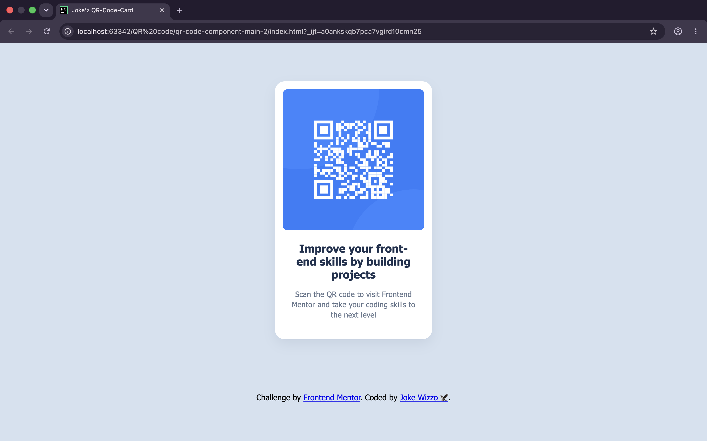
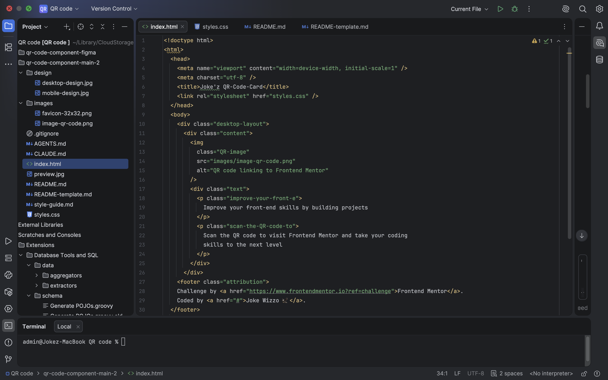

# Frontend Mentor - QR code component solution

This is a solution to the [QR code component challenge on Frontend Mentor](https://www.frontendmentor.io/challenges/qr-code-component-iux_sIO_H). Frontend Mentor challenges help you improve your coding skills by building realistic projects. 

## Table of contents

- [Overview](#overview)
  - [Screenshot](#screenshot)
  - [Links](#links)
- [My process](#my-process)
  - [Built with](#built-with)
  - [What I learned](#what-i-learned)
  - [Continued development](#continued-development)
  - [Useful resources](#useful-resources)
  - [AI Collaboration](#ai-collaboration)
- [Author](#author)
- [Acknowledgments](#acknowledgments)

## Overview

### Screenshot

### Links

- Solution URL: https://www.frontendmentor.io/solutions/responsive-qr-code-card-using-css-grid-j5NybWshp5
- Live Site URL: https://qrcode.wizzoviz.dev

## My process

### Built with

- Semantic HTML5 markup
- CSS custom properties
- Flexbox
- CSS Grid
- Mobile-first workflow

### What I learned

Through this project, I learned how to center a card component on the page and make it responsive across different screen sizes. Even though the component is small, working on it helped me get more comfortable with the fundamentals of layout and responsive design.

### Continued development

I would simply love to keep learning and building some amazing projects ahead, gradually taking on more complex challenges and refining my HTML and CSS skills along the way.

### Useful resources

I did my research online while working on this challenge. I'll update this section with specific resources once I go back through my notes and can properly credit the articles and guides that helped me the most.

### AI Collaboration

Yes, I used AI tools during this project:

- **Claude Code** — I used it to research how to properly center-align my content and better understand the layout options available in CSS.
- **GitHub Copilot** — I used it for code inspection, spotting errors, and suggesting corrections as I built out the component.

Overall, the AI tools worked well as learning companions — they helped me understand concepts and catch mistakes without replacing the hands-on work of actually building the project myself.

## Author

- Website - [Joke wizzo](https://www.wizzoviz.tech/)
- Frontend Mentor - [Kuach-joke](https://www.frontendmentor.io/profile/Kuach-joke)
- Twitter - [stillwizzo](https://x.com/stillwizzo)
- LinkedIn - [Kuach John](https://www.linkedin.com/in/kuach-john-565ab62aa/)

## Acknowledgments

I completed this challenge on my own, so I'd simply like to acknowledge myself for pushing through and seeing this project to completion. Even though it's small and precise, finishing it is a meaningful step in my learning journey.
